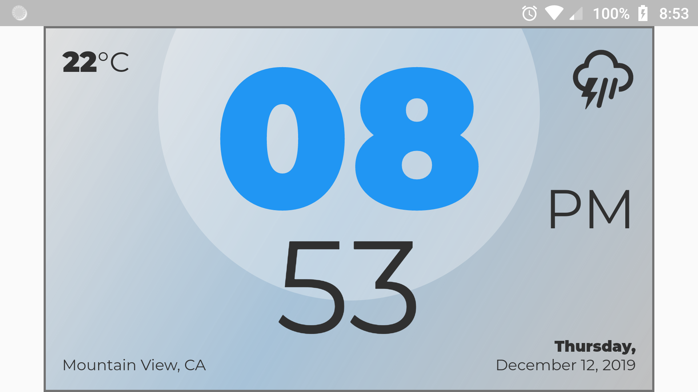
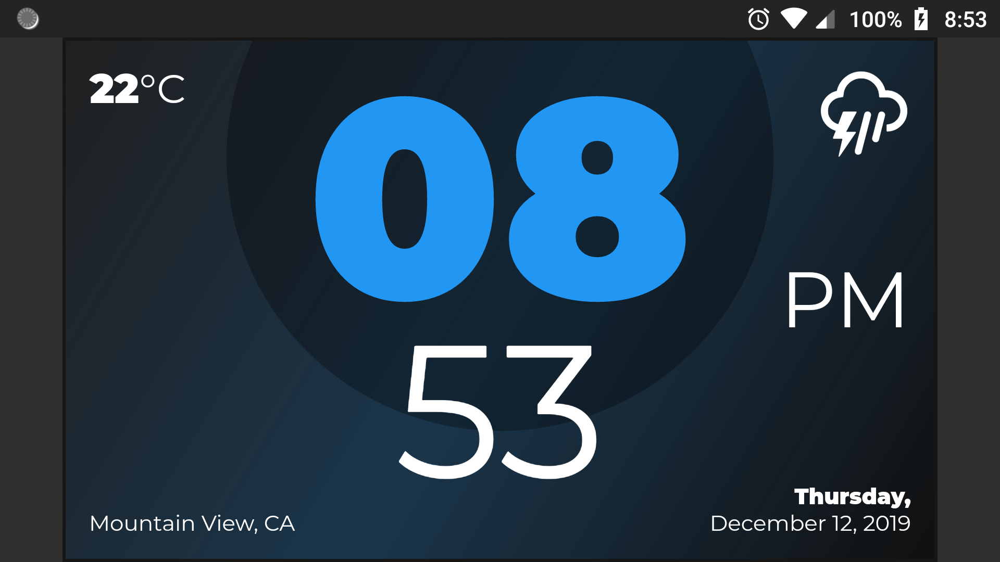

# Flutter Clock

This is my participation for the [Flutter Clock Challenge](https://flutter.dev/clock)!

## Screenshots

### Light mode

### Dark mode

## Credits

Fonts: 

* [Montserrat](https://fonts.google.com/specimen/Montserrat)

Icons:

* [erikflowers/weather-icons](https://github.com/erikflowers/weather-icons)
