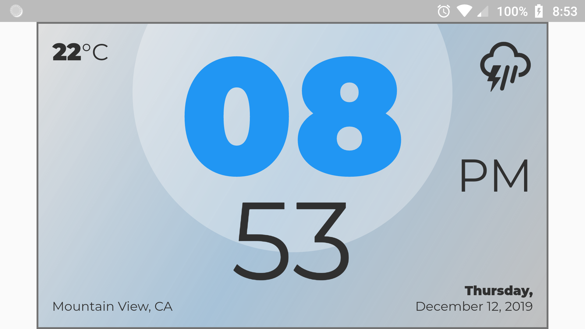
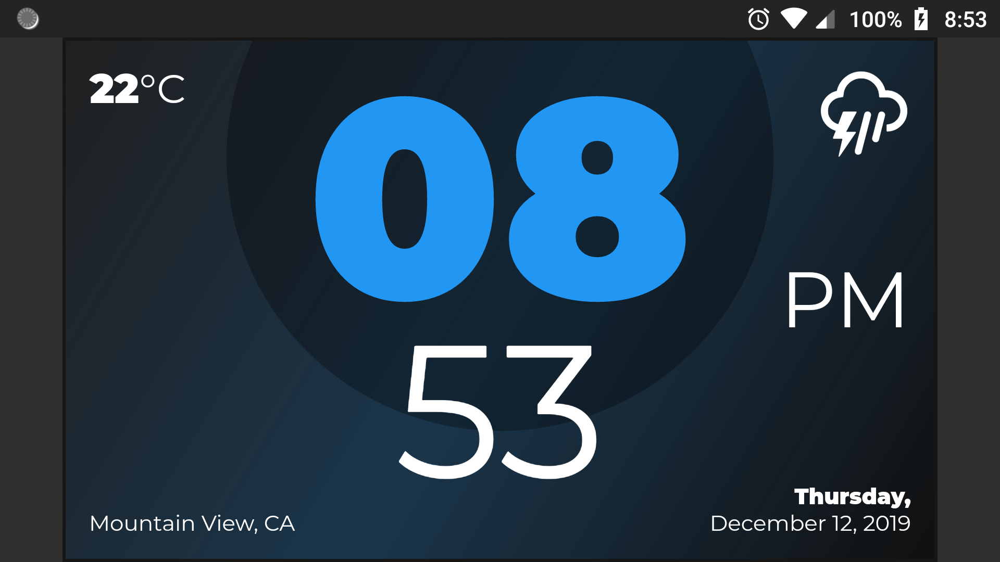

# Challenge Digital Clock

This is my participation for the [Flutter Clock Challenge](https://flutter.dev/clock)!

## Screenshots

### Light mode

### Dark mode

## Todo

- [ ] Tests
- [ ] Separate digital clock into small parts
